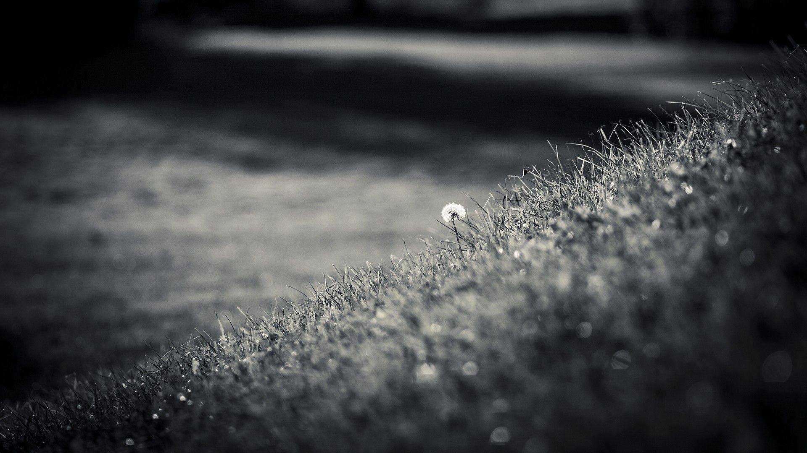
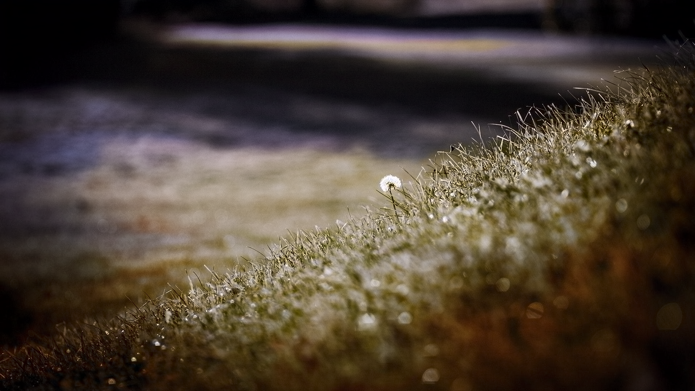
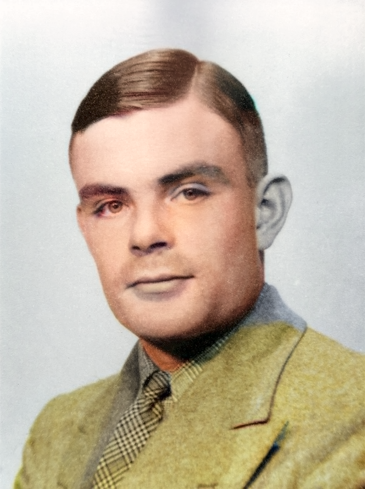
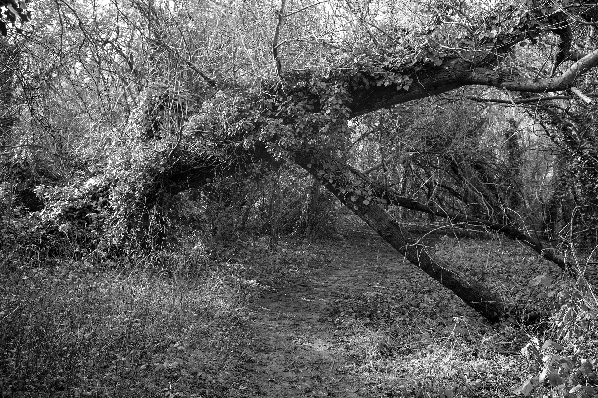
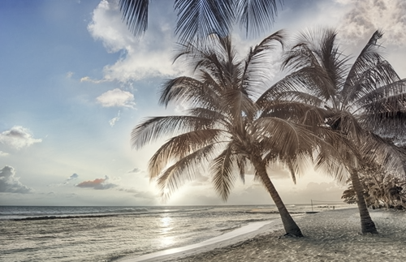

# 🎨 Image Colorization with Diffusion Models

Automatic colorization of grayscale images using **Conditional Diffusion Models** trained on 128×128 resolution. This project leverages UNet2D architecture with DDPM (Denoising Diffusion Probabilistic Models) for high-quality image colorization in LAB color space.

---

## 📊 Results

### Sample Colorizations

<table>
  <tr>
    <th>Grayscale Input</th>
    <th>Colorized Output</th>
  </tr>
  <tr>
    <td></td>
    <td></td>
  </tr>
  <tr>
    <td></td>
    <td></td>
  </tr>
  <tr>
    <td></td>
    <td></td>
  </tr>
  <tr>
    <td></td>
    <td></td>
  </tr>
</table>

---

## 🚀 Features

- **Conditional Diffusion Model** for image colorization
- **UNet2DModel** with attention blocks 
- **LAB Color Space** processing for better perceptual quality
- **Mixed Precision Training** (FP16) for memory efficiency
- **Multi-GPU Support** with DataParallel
- **Checkpoint Management** with mid-epoch saving
- **Training History Tracking** with visualization
- **128×128 Resolution** optimized for GPU memory

---

## 🏗️ Architecture

```
Input: Grayscale (L channel) → UNet2D → Predicted AB channels → Colorized Image
                                  ↑
                          Diffusion Process
                    (Add noise → Denoise iteratively)
```

**Model Components:**
- **UNet2D** with 4 down/up blocks and attention
- **DDPM Scheduler** with 1000 timesteps
- **Conditional Input**: L channel guides colorization
- **Output**: AB channels predicted from noisy input

---

## 📁 Project Structure

```
Image-Colorization/
├── notebooks/
│   ├── image-colorization.ipynb    # Main training notebook
│   ├── Inference.ipynb             # Inference notebook
│   └── ...                          # Other experimental notebooks
├── Samples/
│   ├── grayscale/                   # Sample input images
│   └── colorized/                   # Sample output images
├── requirements.txt                 # Python dependencies
└── README.md
```

---

## ⚙️ Setup

### 1. Clone Repository
```bash
git clone https://github.com/AyusK4/Image-Colorization-with-Diffusion-model.git
cd Image-Colorization-with-Diffusion-model
```

### 2. Install Dependencies
```bash
pip install -r requirements.txt
```

### 3. Required Packages
- PyTorch 2.0+
- diffusers
- transformers
- accelerate
- h5py
- scikit-image
- matplotlib
- tqdm

---

## 🎓 Training

### Configuration
- **Resolution**: 128×128
- **Batch Size**: 88
- **Learning Rate**: 2e-4 (AdamW)
- **Epochs**: 27
- **Diffusion Steps**: 1000
- **Scheduler**: Cosine Annealing

### Run Training
```bash
# Open the main training notebook
jupyter notebook notebooks/image-colorization.ipynb
```


## 📈 Training Metrics

The model tracks:
- **Training Loss** (MSE between predicted and actual noise)
- **Validation Loss**
- **Learning Rate Schedule**
- **Epoch Time**


## 🛠️ Technical Details

### LAB Color Space
- **L**: Lightness (0-100) - Grayscale input
- **A**: Green-Red axis (-128 to 127)
- **B**: Blue-Yellow axis (-128 to 127)

The model predicts **AB channels** conditioned on the **L channel**, then converts back to RGB.

### Diffusion Process
1. **Forward**: Add Gaussian noise to AB channels
2. **Reverse**: UNet predicts noise, iteratively denoises
3. **Conditioning**: L channel concatenated with noisy AB

---

## 📊 Dataset

- **Training**: Preprocessed (COCO 2017 Dataset) LAB images stored in HDF5 format
- **Format**: `(N, 128, 128, 3)` float16 arrays
- **Normalization**: L ∈ [0,100], A,B ∈ [-128,127]

---

## 🤝 Contributing

Contributions are welcome! Feel free to:
- Report bugs
- Suggest features
- Submit pull requests

---

## �‍💻 Author

**Ayush KC**  
GitHub: [@AyusK4](https://github.com/AyusK4)

**Note:** This is a personal project for learning and experimentation.

---

## 🙏 Acknowledgments

- **Diffusers Library** by Hugging Face
- **DDPM Paper**: Denoising Diffusion Probabilistic Models
- **UNet Architecture** for image-to-image tasks

---

## 📧 Contact

For questions or collaborations, reach out via GitHub Issues.
